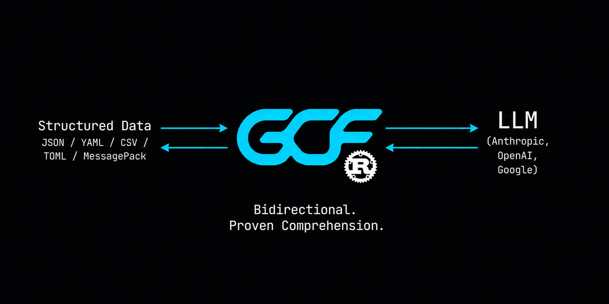

<p align="center">
  
</p>

<p align="center">
  <a href="https://github.com/blackwell-systems"></a>
  <a href="https://github.com/blackwell-systems/gcf-rust/actions"></a>
  <a href="LICENSE"></a>
  <a href="https://crates.io/crates/gcf"></a>
</p>

# gcf-rust

Rust implementation of [GCF](https://gcformat.com/) -- the most token-efficient wire format for LLMs. A drop-in alternative to JSON and TOON for any structured data.

**100% comprehension on every frontier model tested. 29% fewer tokens than TOON, 56% fewer than JSON across 16 datasets. 91.2% on structurally complex code graphs (vs TOON 68.8%, JSON 54.1%). 2,400+ LLM evaluations. Zero training.**

Docs: [gcformat.com](https://gcformat.com/) | [Playground](https://gcformat.com/playground.html) | [GCF vs TOON](https://gcformat.com/guide/vs-toon.html)

## Install

```toml
[dependencies]
gcf = "0.1"
```

Zero-copy where possible. Minimal dependencies (serde, serde_json). Don't want to change code? Use the [MCP proxy](https://github.com/blackwell-systems/gcf-proxy) for zero-code adoption.

## Quick Start

```rust
use gcf::encode_generic;
use serde_json::json;

let data = json!({
    "employees": [
        {"id": 1, "name": "Alice", "department": "Engineering", "salary": 95000},
        {"id": 2, "name": "Bob", "department": "Sales", "salary": 72000},
    ],
});
let output = encode_generic(&data);
```

Output:
```
## employees [2]{department,id,name,salary}
Engineering|1|Alice|95000
Sales|2|Bob|72000
```

Works on any `serde_json::Value`. One header declares field names, rows are positional values.

## Graph Profile

For code graph data with symbols, edges, and distance groups:

```rust
use gcf::{Payload, Symbol, Edge, encode};

let p = Payload {
    tool: "context_for_task".into(), token_budget: 5000, tokens_used: 1847,
    symbols: vec![
        Symbol { qualified_name: "pkg.Auth".into(), kind: "function".into(), score: 0.78, provenance: "lsp".into(), distance: 0, ..Default::default() },
        Symbol { qualified_name: "pkg.Server".into(), kind: "function".into(), score: 0.54, provenance: "lsp".into(), distance: 1, ..Default::default() },
    ],
    edges: vec![Edge { source: "pkg.Server".into(), target: "pkg.Auth".into(), edge_type: "calls".into(), ..Default::default() }],
    ..Default::default()
};
let output = encode(&p);
```

Output:
```
GCF tool=context_for_task budget=5000 tokens=1847 symbols=2 edges=1
## targets
@0 fn pkg.Auth 0.78 lsp
## related
@1 fn pkg.Server 0.54 lsp
## edges [1]
@0<@1 calls
```

## Decode

```rust
use gcf::decode;

let p = decode(input).expect("valid GCF");
println!("{} {} symbols {} edges", p.tool, p.symbols.len(), p.edges.len());
```

## Session Deduplication

Track transmitted symbols across multiple tool responses. Previously-sent symbols become bare references instead of full declarations:

```rust
use gcf::{Session, encode_with_session};

let sess = Session::new();

let out1 = encode_with_session(&payload1, &sess); // full declarations
let out2 = encode_with_session(&payload2, &sess); // reused symbols as "@N  # previously transmitted"
```

By the 5th call in a session: 92.7% token savings vs JSON.

## Streaming Encode

Write GCF output incrementally as symbols and edges arrive. Zero buffering, O(1) memory per row:

```rust
use gcf::{StreamEncoder, StreamOptions, Symbol, Edge};

let enc = StreamEncoder::new(writer, "context_for_task", StreamOptions {
    token_budget: 5000,
    ..Default::default()
});

enc.write_symbol(&Symbol { qualified_name: "pkg.Auth".into(), kind: "function".into(), score: 0.95, provenance: "lsp".into(), distance: 0, ..Default::default() });
enc.write_edge(&Edge { source: "pkg.Server".into(), target: "pkg.Auth".into(), edge_type: "calls".into(), ..Default::default() });
enc.close();
```

Output uses `[?]` deferred counts and `##! summary` trailer. Standard `decode()` handles streaming output with no changes. Thread-safe via Mutex.

## Delta Encoding

When the consumer already has a prior context pack, send only what changed:

```rust
use gcf::{DeltaPayload, Symbol, encode_delta};

let delta = DeltaPayload {
    tool: "context_for_task".to_string(),
    base_root: "aaa111".to_string(),
    new_root: "bbb222".to_string(),
    removed: vec![Symbol {
        qualified_name: "pkg.OldFunc".to_string(),
        kind: "function".to_string(),
        score: 0.0,
        provenance: String::new(),
        distance: 0,
        signature: String::new(),
        components: Default::default(),
    }],
    added: vec![Symbol {
        qualified_name: "pkg.NewFunc".to_string(),
        kind: "function".to_string(),
        score: 0.85,
        provenance: "rwr".to_string(),
        distance: 0,
        signature: String::new(),
        components: Default::default(),
    }],
    removed_edges: vec![],
    added_edges: vec![],
    delta_tokens: 30,
    full_tokens: 200,
};

let output = encode_delta(&delta);
```

81.2% savings on re-queries where the pack changed slightly.

## Generic Encoding

Encode any `serde_json::Value` (not just graph payloads) into GCF tabular format:

```rust
use gcf::encode_generic;
use serde_json::json;

let data = json!({
    "employees": [
        {"id": 1, "name": "Alice", "department": "Engineering", "salary": 95000},
        {"id": 2, "name": "Bob", "department": "Sales", "salary": 72000},
    ],
});
let output = encode_generic(&data);
```

Output:
```
## employees [2]{department,id,name,salary}
Engineering|1|Alice|95000
Sales|2|Bob|72000
```

Works on objects, arrays, and primitives. Arrays of uniform objects get tabular rows. Nested objects use `## key` section headers.

## Generic-Profile Delta (multi-turn)

In an agent loop the same keyed table gets re-queried turn after turn. Instead of re-sending the whole table each time, send only the changed rows (SPEC §10a):

```rust
use gcf::{GenericSet, diff_generic_sets, encode_generic_delta, verify_generic_delta};
use serde_json::json;

let base = GenericSet {
    name: "orders".into(),
    key: "id".into(),
    fields: vec!["id".into(), "status".into()],
    rows: vec![
        json!({"id": 1001, "status": "pending"}).as_object().unwrap().clone(),
        json!({"id": 1002, "status": "shipped"}).as_object().unwrap().clone(),
    ],
};
let next = GenericSet {
    name: "orders".into(),
    key: "id".into(),
    fields: vec!["id".into(), "status".into()],
    rows: vec![
        json!({"id": 1001, "status": "shipped"}).as_object().unwrap().clone(), // changed
        json!({"id": 1003, "status": "pending"}).as_object().unwrap().clone(), // added (1002 removed)
    ],
};

let d = diff_generic_sets(&base, &next).unwrap();       // ## added / ## changed / ## removed
let wire = encode_generic_delta(&d);
let held = verify_generic_delta(&base, &d, &d.new_root).unwrap(); // atomic apply + new_root verification
```

Opt-in and bilateral, keyed on content-addressed pack roots. By the 5th overlapping call, ~97% fewer tokens than re-sending JSON.

### Re-anchor session helper

`GenericDeltaSession` manages the delta/re-anchor cadence for you: each `next` returns either a compact delta or, on its cadence, a full re-anchor (which re-grounds the consumer), updating its held base.

```rust
use gcf::{GenericDeltaSession, ReanchorPolicy};

let mut sess = GenericDeltaSession::new(base, "orders".into(), ReanchorPolicy::size_guard());
let wire = sess.current_full();               // transmit the base once to establish it
for snapshot in stream {                      // each turn's current GenericSet
    let (wire, is_full) = sess.next(snapshot).unwrap(); // a compact delta, or a periodic full re-anchor
}
```

`ReanchorPolicy::fixed_n(15)` re-anchors every N turns; `ReanchorPolicy::size_guard()` (recommended) re-anchors once the cumulative delta reaches a full payload's size. It introduces no new wire syntax and the decoder stays cadence-agnostic, so a re-anchor is just the protocol's "full" outcome on a schedule.

## API

| Function | Description |
|----------|-------------|
| `encode(p: &Payload) -> String` | Encode a graph payload to GCF text |
| `encode_generic(data: &Value) -> String` | Encode any JSON value to GCF tabular format |
| `decode(input: &str) -> Result<Payload, DecodeError>` | Parse GCF text back to a Payload |
| `encode_with_session(p: &Payload, s: &Session) -> String` | Encode with session deduplication |
| `encode_delta(d: &DeltaPayload) -> String` | Encode a delta (added/removed only) |
| `diff_generic_sets(base, next) -> Result<GenericDeltaPayload, String>` | Diff two keyed record sets (generic profile) |
| `encode_generic_delta(d) -> String` / `decode_generic_delta(s)` | Generic-profile delta wire (§10a) |
| `verify_generic_delta(base, d, root) -> Result<GenericSet, String>` | Atomic apply + `new_root` verification |
| `GenericDeltaSession::new(base, tool, policy)` | Producer-side re-anchor cadence helper (§10a.8) |
| `Session::new() -> Session` | Create a new session tracker (thread-safe via Mutex) |

## Types

| Type | Purpose |
|------|---------|
| `Payload` | Full GCF payload: tool, budget, symbols, edges, pack root |
| `Symbol` | Graph node: qualified name, kind, score, provenance, distance |
| `Edge` | Directed relationship: source, target, edge type |
| `DeltaPayload` | Diff between two packs: added/removed symbols and edges |
| `GenericSet` / `GenericDeltaPayload` | Keyed record set and its generic-profile diff (§10a) |
| `GenericDeltaSession` / `ReanchorPolicy` | Stateful producer scheduling delta vs full re-anchor (§10a.8) |
| `Components` | Score breakdown: blast_radius, confidence, recency, distance |
| `Session` | Thread-safe tracker for multi-call deduplication |
| `DecodeError` | Enum of decode failure modes |

## Benchmarks

2,400+ LLM evaluations across 10 models, 3 providers, and 51 independent test runs.

| | GCF | TOON | JSON |
|---|---|---|---|
| **Comprehension** (23 runs, 10 models) | **91.2%** | 68.8% | 54.1% |
| **Generation** (28 runs, 9 models) | **5/5** | 1.0/5 | 5.0/5 |
| **Input tokens** (500 symbols) | **11,090** | 16,378 | 53,341 |
| **Output tokens** (100 symbols) | **5,976** | 8,937 | 16,121 |

GCF wins 15/16 datasets on the expanded [token efficiency benchmark](https://github.com/blackwell-systems/toon/tree/gcf-comparison). Full results: [gcformat.com/guide/benchmarks](https://gcformat.com/guide/benchmarks.html)

## Implementations

| Language | Package | Repository |
|----------|---------|-----------|
| Go | `go get github.com/blackwell-systems/gcf-go` | [gcf-go](https://github.com/blackwell-systems/gcf-go) |
| TypeScript | `npm install @blackwell-systems/gcf` | [gcf-typescript](https://github.com/blackwell-systems/gcf-typescript) |
| Python | `pip install gcf-python` | [gcf-python](https://github.com/blackwell-systems/gcf-python) |
| Rust | `cargo add gcf` | [gcf-rust](https://github.com/blackwell-systems/gcf-rust) |
| Swift | Swift Package Manager | [gcf-swift](https://github.com/blackwell-systems/gcf-swift) |
| Kotlin | JitPack | [gcf-kotlin](https://github.com/blackwell-systems/gcf-kotlin) |
| MCP Proxy | `pip install gcf-proxy` | [gcf-proxy](https://github.com/blackwell-systems/gcf-proxy) (bidirectional, session dedup, HTTP frontend) |
| Claude Code Plugin | `/plugin install` | [gcf-claude-plugin](https://github.com/blackwell-systems/gcf-claude-plugin) (one-command install, session stats hook) |
| Codex Plugin | `codex plugin add` | [gcf-codex-plugin](https://github.com/blackwell-systems/gcf-codex-plugin) (one-command install, session stats hook) |
| VS Code | `ext install blackwell-systems.gcf-vscode` | [gcf-vscode](https://marketplace.visualstudio.com/items?itemName=blackwell-systems.gcf-vscode) (syntax highlighting) |
| n8n | `npm install n8n-nodes-gcf` | [gcf-n8n-nodes](https://github.com/blackwell-systems/gcf-n8n-nodes) (workflow encode/decode) |
| Tree-sitter | `npm install tree-sitter-gcf` | [tree-sitter-gcf](https://github.com/blackwell-systems/tree-sitter-gcf) |

**Minimal dependencies. Permanently.** Rust implementation depends only on serde and serde_json for JSON interop. Five other implementations (Go, TypeScript, Python, Swift, Kotlin) have zero runtime dependencies. No unnecessary transitive dependencies. No supply chain risk. This is a permanent commitment: GCF will never take on external runtime dependencies beyond what the language ecosystem requires for JSON handling. MIT licensed. All implementations support both generic profile (`encode_generic`) and graph profile (`encode`). CLI included in all 6 languages.

**Specification:** [SPEC v3.4.1 Stable](https://github.com/blackwell-systems/gcf/blob/main/SPEC.md) with 204 conformance fixtures, 43,000,000,000+ lossless round-trips verified across 5 formats and 6 languages. All implementations at v2.4.0+ (Go v1.5.0). Cross-language 6x6 matrix verified.

## Adopted by

[Chrome DevTools MCP](https://github.com/ChromeDevTools/chrome-devtools-mcp) (46K stars, Google Chrome DevTools team) · [Speakeasy](https://speakeasy.com) (API tooling, customers include Google, Verizon, Mistral AI, DocuSign, Vercel) · [OmniRoute](https://omniroute.online) (6.1K stars) · [NetClaw](https://github.com/automateyournetwork/netclaw) (556 stars) · [ctx](https://github.com/stevesolun/ctx) (510 stars) · [NeuroNest](https://neuronest.cc) · [Open Data Products SDK](https://opendataproducts.org/sdk/) (Linux Foundation) · [Raycast](https://raycast.com/blackwell-systems/json-to-gcf-converter) · [and more](https://gcformat.com/ecosystem/adopters.html)

## License

MIT - [Dayna Blackwell](https://github.com/blackwell-systems)
